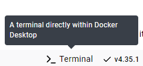
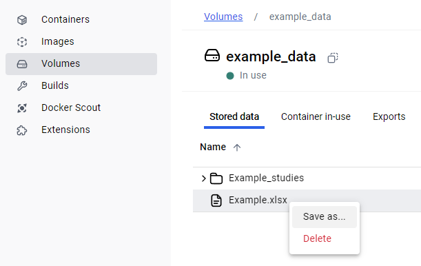

## Repository for my Bachelorthesis
“Evaluation of drought definitions in scientific publications using automated information retrieval:  An examination of the methodology and accuracy of scientific publications in forested areas on drought”

<a id="readme-top"></a>
<!-- TABLE OF CONTENTS -->
  <summary>Table of Contents</summary>
  <ol>
    <li>
      <a href="#about-the-project">About the project</a>
    </li>
    <li>
      <a href="#getting-started">Getting Started</a>
      <ul>
        <li><a href="#prerequisites">Prerequisites</a></li>
        <li><a href="#usage">Usage</a></li>
        <li><a href="#results">Results</a></li>
      </ul>
    </li>
    <li><a href="#plotting">Plotting</a></li>
    <li><a href="#license">License</a></li>
    <li><a href="#contact">Contact</a></li>
    <li><a href="#links">Links</a></li>
  </ol>

## About The Project

This Python program was implemented, to test the possibilities of automatic information retrieval with the help of (Python) scripts to speed up 
and simplify the time-consuming manual
information retrieval part of literature reviews in general within the scope of a Bachelorthesis.

The literature review conducted in my thesis is in the context of drought characterization including the used drought definitions and their correctness in forested ecosystems.
Therefore, this program is specifically designed for extracting different information about and in correlation of drought.


<p align="right">(<a href="#readme-top">back to top</a>)</p>

## Getting Started

The program published here is also available via Docker Hub. This allows all users to access and run it and offers the possibility for reproducible working and testing. 
Example data is made available for users to execute the program without having to provide their own data. Also the example data and results can be downloaded easily through this way.

Included are examples of studies for ignoring originally wrongly found coordinates, through the PDF format incorrectly formatted coordinates in the PDFs 
which were converted and found by formatting them back to their original, as well as studies which did not give the coordinates directly 
to show how the described study area is then searched for and extracted to help the search for coordinates in the manual verification step in order to be able to perform the reanalysis. 
Furthermore, there are examples which show that often several keywords are selected for the manual verification process in order to choose the most decisive one for the study type and drought definitions.
The examples given also include studies for which automatic information retrieval worked rather poorly.  
This applies, for example, to the extraction of years with or without drought in order to identify redundancies, but also for studies where no or only few relevant information could be extracted from the text 
due to completely false formating of PDFs or because simply there is no relevant information provided.

### Prerequisites

To execute the program, Docker Desktop is needed.

[Installation manual for Windows](https://docs.docker.com/desktop/setup/install/windows-install/)  
[Installation manual for Mac](https://docs.docker.com/desktop/setup/install/mac-install/)
  
### Usage

When Docker Desktop is installed and set up, the following steps can be taken to run the program:

1. Open the internal terminal of Docker Desktop on the bottom right:  
   


2. Pull the Docker image from Dockerhub:  
    2.1. For Windows (amd64) operating system:
    ```sh
    docker pull --platform linux/amd64 jonathanmw/automated_information_retrieval:amd64  
    ```
    2.2. For Mac (arm64) operating system:  
    ```sh
    docker pull --platform linux/arm64 jonathanmw/automated_information_retrieval:arm64
    ```

3. Start the Image using Docker Desktop:  
   3.1. For Windows (amd64) operating system:
   ```sh
   docker run -v example_data:/app/data jonathanmw/automated_information_retrieval:amd64  
   ```
   3.2. For Mac (arm64) operating system:  
    ```sh 
    docker run -v example_data:/app/data jonathanmw/automated_information_retrieval:arm64
    ```
  
This will run the pulled Docker Image and put the logs into the internal Docker terminal directly, to allow user to be sure that it started and what it is doing.


<p align="right">(<a href="#readme-top">back to top</a>)</p>

### Results

The output of the program is an updated Excel Open XML Spreadsheet (XLSX) file.  
This file can be downloaded from the, by the command created, Volume in the 'Volumes' section' of Docker Desktop.



<p align="right">(<a href="#readme-top">back to top</a>)</p>

<!-- Plotting -->
## Plotting

All plots (bar- and pie- charts) presented in the Bachelorthesis were also created using Python.
Since the functionality of this Python script is higher when working locally (allows to directly save and show the plots and better debugging), it is not available via Docker Hub.

### Prerequisites
Instead, it is recommended to use the GitHub Desktop application, to clone this repository, and the execute this script using the individually preferred IDE.

[Installation manual for Windows](https://docs.github.com/en/desktop/installing-and-authenticating-to-github-desktop/installing-github-desktop?platform=windows)  
[Installation manual for Mac](https://docs.github.com/en/desktop/installing-and-authenticating-to-github-desktop/installing-github-desktop?platform=mac)

### Usage
Once GitHub Desktop is installed and set up, clone the repository by clicking on 'File' on the upper left and then selecting 'Clone Repository'.


Now select 'URL' and enter the URL of this Repository (https://github.com/JonthMM/Bachelor-thesis) and select the preferred local folder it should be saved to.


After the cloning process is finished, the script 'Creating_plots_template.py' can be opened, then modified as desired and executed.  
This is an empty template version of the 'Creating_plots.py' script, which does not contain any already set file paths, since these have to be changed to the local ones needed individually.  
It also includes an example and hints, where and what to change in order the run the example.
For testing usage, the folder 'plotting_example_data' also contains the final shapefiles and XLSX file from the literature review conducted for my Bachelorthesis.

### Output

The script shows, and saves desired pie- and barcharts as .jpg in the locally specified folders.

The example provided in the template includes one pie- and one barplot.

### Further development

The script has dedicated functions for pie- and bar- charts generally and also two more for special bar plot cases.
All functions are divided in cases for each factor in general as well as its correlation regarding drought definitions and SPEI categories.
This case division allows to easily expand each function by adding a new case using already implemented code from other cases.

To also simplify the process of further developing the script (for another bachelorthesis or in general), it is rather overly commented to allow for a precise understanding of everything that was done.

<p align="right">(<a href="#readme-top">back to top</a>)</p>

<!-- LICENSE -->
## License

Distributed under the MIT License. See [LICENSE](https://github.com/JonthMM/Bachelor-thesis/blob/main/LICENSE) for more information.

<p align="right">(<a href="#readme-top">back to top</a>)</p>

<!-- CONTACT -->
## Contact

Jonathan Mattis Wisser - jmader@uni-muenster.de

Project Link: [https://github.com/JonthMM/Bachelor-thesis](https://github.com/JonthMM/Bachelor-thesis)

<p align="right">(<a href="#readme-top">back to top</a>)</p>

<!-- LINKS -->
## Links

All data is also available here, including the shapefile and their attribute tables as XSLX files, aswell as the manually verified XSLX file.
This platform, in contrast to GitHub, allows to view and edit XSLX files online.
https://uni-muenster.sciebo.de/s/Gy1fD6fWTfTYStg

This readme template is based on the BLANK_README.md example of the following project:  
https://github.com/othneildrew/Best-README-Template/tree/main

<p align="right">(<a href="#readme-top">back to top</a>)</p>